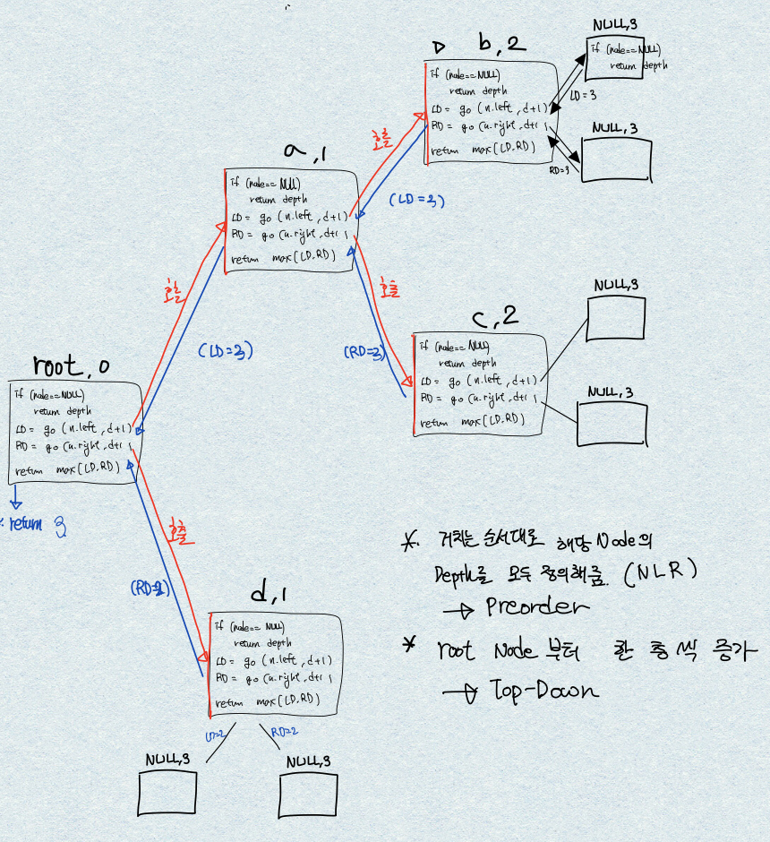
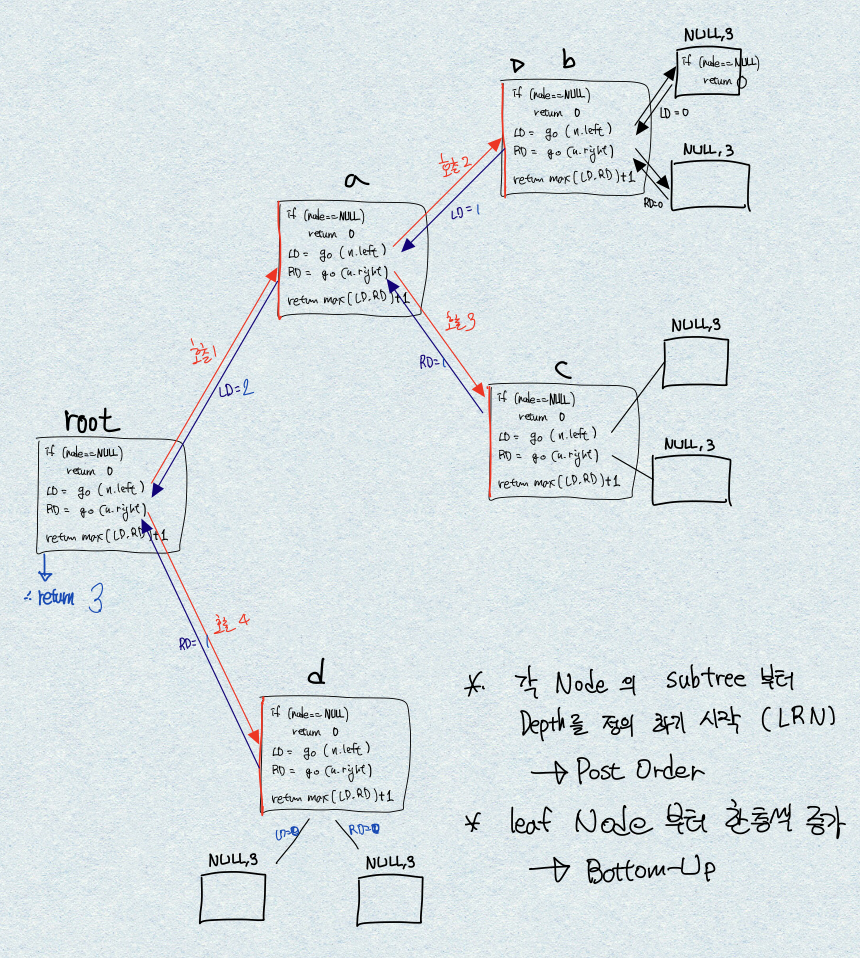

# Maximum Depth of Binary Tree
https://leetcode.com/explore/interview/card/top-interview-questions-easy/94/trees/555/

## Solution
### 1. preorder - Top-down  
~~~
//int-return
int preDepth(node, depth) {  
    if (node == NULL):   
        return depth  
    left_Depth = preDepth(node.left, depth+1)  
    right_Depth = preDepth(node.right, depth+1)  

    return max(left_Depth, right_Depth);  
}  
~~~
~~~
//void-return
int answer = 0;
void preDepth2(node, depth) {
    if (node == NULL):
        answer = max(answer, depth)
    preDepth2(node.left, depth+1)
    preDepth2(node.right, depth+1)
}
~~~

### 2. postorder - Bottom-up  
~~~
//int-return
int postDepth(node) {
    if (node == NULL):
        return 0
    left_Depth = postDepth(node.Left)
    right_Depth = postDepth(node.right)

    return max(left_Depth, right_Depth) + 1
}
~~~
